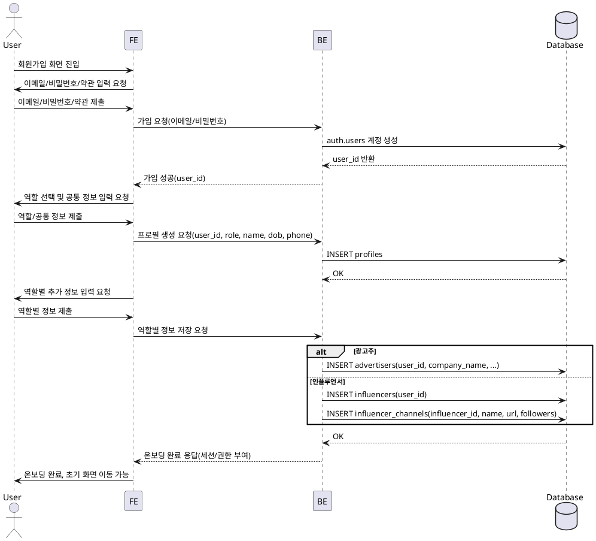

# 001 — 회원가입 & 온보딩(역할 선택) Use Case

## Primary Actor
- 신규 사용자(광고주 또는 인플루언서)

## Precondition (사용자 관점)
- 계정이 없다.
- 이메일 수신이 가능한 상태다.
- 안정적인 네트워크 환경이다.

## Trigger
- 사용자가 회원가입 화면에 진입하여 가입 절차를 시작한다.

## Main Scenario
1. 사용자가 이메일/비밀번호, 약관 동의를 제출한다.
2. 시스템이 계정을 생성하고 세션을 준비한다.
3. 사용자가 역할(광고주/인플루언서)을 선택한다.
4. 사용자가 공통 정보(이름/생년월일/휴대폰번호)를 입력한다.
5. 선택한 역할에 따라 추가 정보를 입력한다.  
   - 광고주: 업체명, 사업자등록번호, 대표자명, 업장 전화번호, 주소  
   - 인플루언서: SNS 채널명, 채널 링크, 팔로워 수
6. 시스템이 프로필과 역할별 상세 정보를 저장한다.
7. 시스템이 온보딩 완료 상태를 반영하고 초기 화면으로 이동 가능하게 한다.

## Edge Cases
- 이메일 중복 → 가입 거부 및 재입력 유도
- 비밀번호 정책 위반 → 클라이언트/서버 검증 실패
- 약관 미동의 → 가입 진행 차단
- 역할 미선택/필수 정보 누락 → 단계 진행 차단
- URL/사업자번호/날짜 형식 오류 → 검증 실패
- 네트워크/서버 오류 → 재시도 가능 상태 유지(중복 생성 방지)
- 동일 사용자가 다른 역할로 재온보딩 시도 → 중복 역할 생성 차단

## Business Rules
- 역할 선택은 필수이며, 1개 계정은 동일 시점에 1개 역할로 온보딩한다.
- 공통 정보와 역할별 필수 정보가 모두 유효해야 온보딩 완료가 가능하다.
- 인플루언서의 채널 링크는 사용자별 고유해야 한다.
- 회원가입 및 온보딩 완료 후에만 기능별 접근 권한이 부여된다.

## Sequence Diagram (PlantUML)

