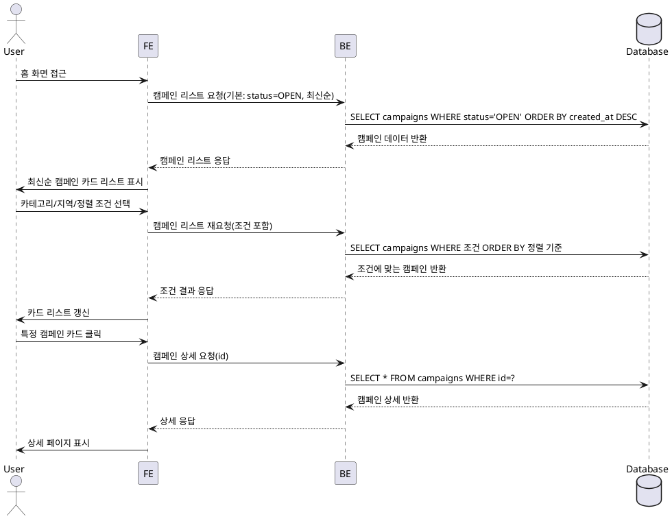

# 002 — 캠페인 탐색 & 필터링 Use Case

## Primary Actor
- 인플루언서(캠페인 지원을 고려하는 사용자)
- 광고주(경쟁사 캠페인 확인을 원하는 경우)

## Precondition (사용자 관점)
- 회원가입 및 온보딩을 완료했다.
- 로그인 상태다.

## Trigger
- 사용자가 홈 화면 또는 탐색 페이지에 진입한다.

## Main Scenario
1. 사용자가 홈 화면에 접근한다.
2. 시스템이 기본적으로 모집 중인 캠페인 리스트를 최신순으로 보여준다.
3. 사용자가 카테고리 또는 지역을 선택한다.
4. 사용자가 정렬 옵션(최신순/인기순)을 변경할 수 있다.
5. 시스템이 선택 조건을 반영하여 `campaigns`에서 조회한다.
6. 시스템이 결과를 카드 리스트 형태로 반환한다.
7. 사용자가 특정 캠페인 카드를 클릭하면 상세 페이지로 이동한다.

## Edge Cases
- 조건에 맞는 캠페인이 없는 경우 → 빈 리스트 UI 표시
- DB 지연/오류 → 로딩 상태 유지 또는 오류 메시지 표시
- 인기순 조건을 만족하는 캠페인이 없는 경우 → 최신순 결과 반환
- 사용자가 필터를 연속으로 클릭 시 → 디바운스 처리

## Business Rules
- 기본 정렬은 최신순이다.
- 인기순은 조회수 또는 지원자가 모집 정원의 2배 이상인 캠페인을 우선으로 한다.
- 검색 결과는 페이지네이션 또는 무한 스크롤로 제공한다.

## Sequence Diagram (PlantUML)

