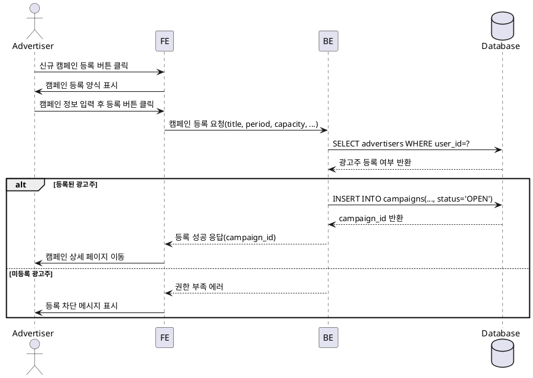

# 003 — 캠페인 생성 (광고주) Use Case

## Primary Actor
- 광고주(사업자 등록을 완료한 사용자)

## Precondition (사용자 관점)
- 광고주로 회원가입 및 온보딩을 완료했다.
- 광고주 대시보드에 접근할 수 있는 권한이 있다.

## Trigger
- 광고주가 대시보드에서 신규 캠페인 등록 버튼을 클릭한다.

## Main Scenario
1. 광고주가 신규 캠페인 등록 버튼을 클릭한다.
2. 시스템이 캠페인 등록 양식을 표시한다.
3. 광고주가 캠페인명, 모집기간(start_date/end_date), 모집인원(capacity), 제공혜택, 매장정보, 미션, 카테고리, 지역, 선정 마감 기한을 입력한다.
4. 광고주가 등록 버튼을 클릭한다.
5. 시스템이 입력값을 검증한다.
6. 시스템이 광고주 권한(사업자 등록 여부)을 검증한다.
7. 시스템이 `campaigns` 테이블에 레코드를 생성한다(초기 상태: OPEN).
8. 시스템이 성공적으로 캠페인 상세 페이지를 생성한다.

## Edge Cases
- 사업자 등록이 완료되지 않은 광고주 → 캠페인 등록 차단
- 모집기간이 과거 날짜 → 검증 실패
- 모집인원이 0 이하 → 검증 실패
- 네트워크/서버 오류 → 등록 실패, 재시도 유도

## Business Rules
- 캠페인은 반드시 정원(capacity) > 0 이어야 한다.
- 모집기간은 현재 날짜 이후여야 한다.
- 캠페인 생성 시 상태는 OPEN으로 초기화된다.

## Sequence Diagram (PlantUML)

