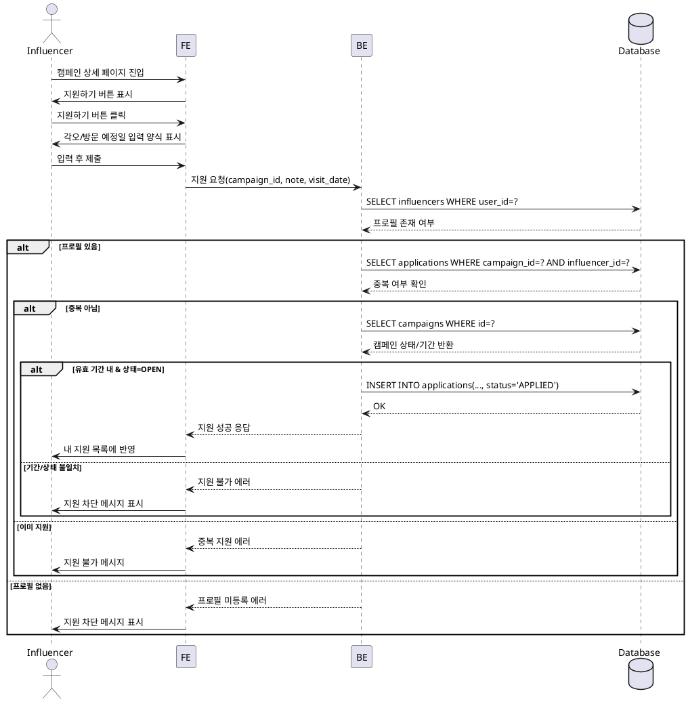

# 004 — 캠페인 지원 (인플루언서) Use Case

## Primary Actor
- 인플루언서(온보딩을 완료한 사용자)

## Precondition (사용자 관점)
- 인플루언서로 회원가입 및 온보딩을 완료했다.
- 로그인 상태다.
- 캠페인이 OPEN 상태다.

## Trigger
- 인플루언서가 캠페인 상세 페이지에서 지원하기 버튼을 클릭한다.

## Main Scenario
1. 인플루언서가 캠페인 상세 페이지에 진입한다.
2. 인플루언서가 지원하기 버튼을 클릭한다.
3. 시스템이 지원 입력 양식을 표시한다(각오, 방문 예정일).
4. 인플루언서가 각오 및 방문 예정일을 입력 후 제출한다.
5. 시스템이 인플루언서 프로필 등록 여부를 확인한다.
6. 시스템이 동일 캠페인 중복 지원 여부를 확인한다.
7. 시스템이 방문 예정일이 캠페인 모집기간 내인지 확인한다.
8. 시스템이 `applications`에 새로운 레코드를 생성한다(상태: APPLIED).
9. 시스템이 성공적으로 내 지원 목록에 반영한다.

## Edge Cases
- 인플루언서 프로필 미등록 → 지원 차단
- 동일 캠페인 중복 지원 → 지원 거부
- 방문 예정일이 캠페인 모집기간 외 → 검증 실패
- 캠페인 상태가 CLOSED/SELECTED → 지원 차단
- 네트워크/서버 오류 → 재시도 가능 상태 유지

## Business Rules
- 1인 1캠페인 1회 지원 원칙이다.
- 지원은 모집기간 내에서만 가능하다.
- 지원이 생성되면 초기 상태는 APPLIED다.

## Sequence Diagram (PlantUML)

