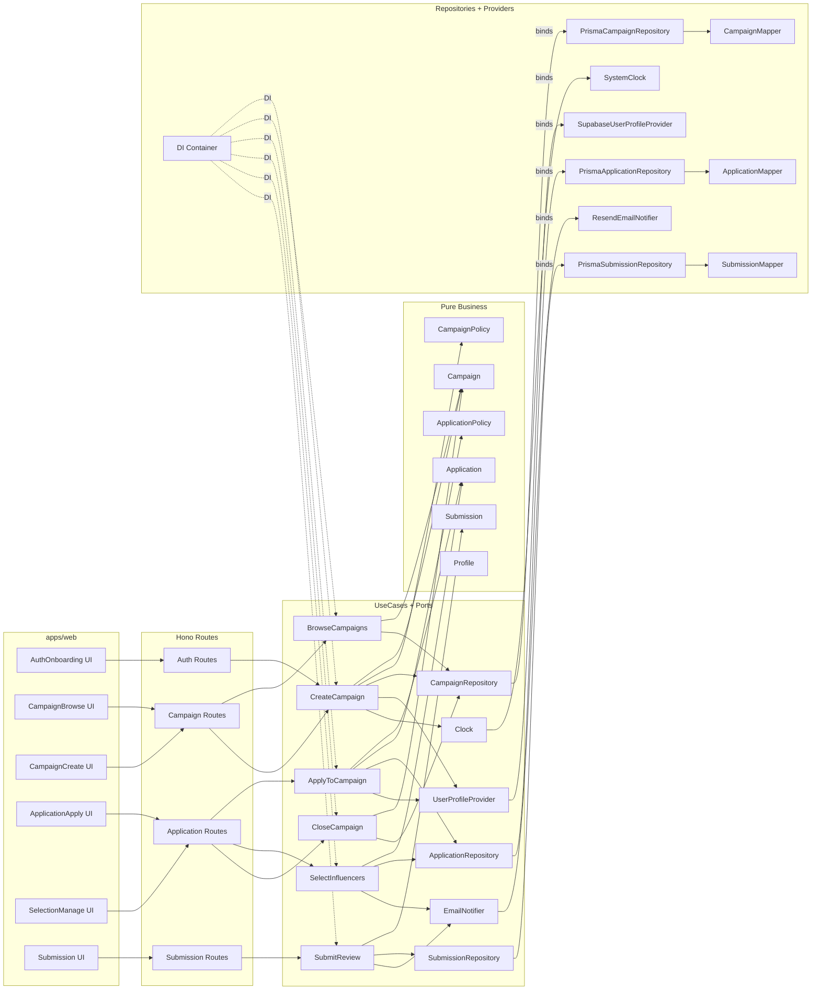

# plan.md — 모듈화 설계 (최소 스펙)

> 대상 범위: `/docs/001~006/spec.md` 유스케이스(회원가입·온보딩, 탐색, 생성, 지원, 모집종료·선정, 리뷰제출)
> 코드베이스 규격: **AGENT.md (모노레포 레이어드 아키텍처 + SOLID)**

---

## 1) 개요 (Modules Overview)

> 모듈 이름 · 위치 · 간략 설명 — **요소는 반드시 아래 경로 규칙**을 따름

### Presentation (apps/web)
- **AuthOnboarding UI** — `apps/web/app/(auth)/*`, `apps/web/features/auth/*`
  - 가입/로그인/역할선택/프로필 입력 UI, RHF + zod 검증, React Query mutation
- **CampaignBrowse UI** — `apps/web/app/(public)/page.tsx`, `apps/web/features/campaigns/*`
  - 카테고리/지역 필터, 정렬, 카드 리스트, 페이지네이션
- **CampaignCreate UI (Advertiser)** — `apps/web/app/(auth)/dashboard/campaigns/new/page.tsx`, `apps/web/features/campaigns/*`
  - 캠페인 생성 폼(기간/정원/혜택/미션/카테고리/지역/선정마감)
- **ApplicationApply UI (Influencer)** — `apps/web/app/(auth)/campaigns/[id]/apply/page.tsx`, `apps/web/features/applications/*`
  - 각오/방문 예정일 입력 및 제출
- **SelectionManage UI (Advertiser)** — `apps/web/app/(auth)/dashboard/campaigns/[id]/manage/page.tsx`, `apps/web/features/applications/*`
  - 모집 종료, 선정/대기자 지정 테이블/액션
- **Submission UI (Influencer)** — `apps/web/app/(auth)/applications/[id]/submit/page.tsx`, `apps/web/features/submissions/*`
  - 리뷰 URL 제출 폼

> 공통 규칙: 모든 컴포넌트는 **`"use client"`**, placeholder 이미지는 **picsum.photos**, 모든 HTTP는 **`@/lib/remote/api-client`** 경유

### Backend (Hono + Route Handlers)
- **Auth Routes** — `apps/web/app/api/[[...hono]]/route.ts` → `packages/infra/config/container.ts` 바인딩 → `features/*/backend/route.ts`
- **Campaign Routes** — `apps/web/app/api/[[...hono]]/route.ts` + `apps/web/features/campaigns/backend/route.ts`
- **Application Routes** — `apps/web/features/applications/backend/route.ts`
- **Submission Routes** — `apps/web/features/submissions/backend/route.ts`

### Application (UseCases + Ports)
- **UseCases** — `packages/core/application/use-cases/`
  - `CreateCampaign.usecase.ts`
  - `BrowseCampaigns.usecase.ts`
  - `ApplyToCampaign.usecase.ts`
  - `CloseCampaign.usecase.ts`
  - `SelectInfluencers.usecase.ts`
  - `SubmitReview.usecase.ts`
- **Ports (Interfaces)** — `packages/core/application/ports/`
  - `CampaignRepository.port.ts`
  - `ApplicationRepository.port.ts`
  - `SubmissionRepository.port.ts`
  - `UserProfileProvider.port.ts`
  - `EmailNotifier.port.ts`
  - `Clock.port.ts`

### Domain (Pure Business)
- **Entities/Services** — `packages/core/domain/*`
  - `campaign/Campaign.ts`, `campaign/CampaignPolicy.ts`
  - `application/Application.ts`, `application/ApplicationPolicy.ts`
  - `submission/Submission.ts`
  - `user/Profile.ts`
  - **정책**: 정원>0, 모집기간 유효성, 상태전이(OPEN→CLOSED, CLOSED→SELECTED), 중복지원 금지, 선정 시 용량 제약, 리뷰는 SELECTED만 허용

### Infrastructure (Adapters)
- **Repositories (Prisma)** — `packages/infra/repositories/*`
  - `PrismaCampaignRepository.ts`
  - `PrismaApplicationRepository.ts`
  - `PrismaSubmissionRepository.ts`
- **Providers** — `packages/infra/providers/*`
  - `SupabaseUserProfileProvider.ts` (Auth 컨텍스트)
  - `ResendEmailNotifier.ts` (이메일 알림)
  - `SystemClock.ts`
- **Mappers** — `packages/infra/mappers/*`
  - `CampaignMapper.ts`, `ApplicationMapper.ts`, `SubmissionMapper.ts`
- **DI** — `packages/infra/config/container.ts`

### Shared
- **DTO/Schema** — `packages/core/application/dto/*` (zod 스키마, 입/출력 DTO)
- **Types/Errors** — `packages/core/shared/*` (Result/Either, 도메인 에러)
- **UI Utils** — `apps/web/lib/*`, `apps/web/hooks/*` (뷰 전용 포맷터/훅)

---

## 2) Diagram (Mermaid)

---

## 3) Implementation Plan

### A. Presentation (QA Sheet 포함)

**공통(규칙):**
- 모든 컴포넌트 파일 상단 `"use client"`
- `page.tsx`의 `params`는 Promise props 사용
- HTTP는 `@/lib/remote/api-client` 경유 (React Query `useQuery/useMutation`)
- 폼: `react-hook-form` + `@hookform/resolvers/zod`

1) AuthOnboarding UI
- 위치: `apps/web/app/(auth)/*`, `apps/web/features/auth/*`
- 작업: 가입/로그인/역할 선택/프로필 입력 폼, 단계적 제출, 에러/진행상태
- **QA 체크리스트:**
  - [ ] 이메일/비밀번호/약관 검증 동작
  - [ ] 역할 미선택 시 진행 차단
  - [ ] 공통/역할별 필수값 누락 시 에러
  - [ ] 중복 이메일 시도 시 서버 에러 반영
  - [ ] 성공 후 세션/리다이렉트 동작

2) CampaignBrowse UI
- 위치: `apps/web/app/(public)/page.tsx`, `apps/web/features/campaigns/*`
- 작업: 필터(카테고리/지역), 정렬(최신/인기), 카드 리스트, 페이지네이션
- **QA 체크리스트:**
  - [ ] 기본 최신순 노출
  - [ ] 조건 무결 시 빈 리스트 표시
  - [ ] 디바운스 및 중복 요청 방지

3) CampaignCreate UI (Advertiser)
- 위치: `apps/web/app/(auth)/dashboard/campaigns/new/page.tsx`
- 작업: 필수 필드 검증, 날짜 범위 검증, 제출 후 상세로 이동
- **QA 체크리스트:**
  - [ ] capacity > 0 검증
  - [ ] 시작/종료/선정마감 유효성
  - [ ] 미등록 광고주 차단

4) ApplicationApply UI
- 위치: `apps/web/app/(auth)/campaigns/[id]/apply/page.tsx`
- **QA 체크리스트:**
  - [ ] 중복 지원 차단 동작
  - [ ] 방문 예정일 범위 검증
  - [ ] 캠페인 상태 CLOSED/SELECTED 시 차단

5) SelectionManage UI
- 위치: `apps/web/app/(auth)/dashboard/campaigns/[id]/manage/page.tsx`
- **QA 체크리스트:**
  - [ ] 모집 종료 → 상태 CLOSED 반영
  - [ ] 선정/대기자 업데이트 결과 반영
  - [ ] 선정 마감 기한 초과 시 차단

6) Submission UI
- 위치: `apps/web/app/(auth)/applications/[id]/submit/page.tsx`
- **QA 체크리스트:**
  - [ ] URL 형식 검증
  - [ ] SELECTED 상태 확인
  - [ ] 중복 제출 차단

---

### B. Application & Domain (Unit Tests 포함)

1) UseCases 구현
- 경로: `packages/core/application/use-cases/*`
- 항목: `CreateCampaign`, `BrowseCampaigns`, `ApplyToCampaign`, `CloseCampaign`, `SelectInfluencers`, `SubmitReview`
- 공통: 입력 DTO(zod) → 도메인 정책 검증 → Port 호출 → Result 반환

2) Domain 정책/엔티티
- 경로: `packages/core/domain/*`
- `CampaignPolicy`: 기간 유효성, 정원 > 0, 상태 전이 규칙
- `ApplicationPolicy`: 중복 지원 금지, 기간·상태 체크, 선정/대기 제약
- `Submission`: SELECTED 상태만 허용

3) **Unit Test 계획** (Vitest/Jest)
- 위치: `packages/core/**/__tests__/*`
- 케이스 예시:
  - CreateCampaign: 과거 기간, 정원 0, 정상 생성
  - ApplyToCampaign: 중복 지원, 기간 외, 캠페인 상태, 정상 신청
  - CloseCampaign: 이미 CLOSED, 정상 전환
  - SelectInfluencers: 정원 초과, 마감 기한 초과, 정상 선정/대기
  - SubmitReview: 상태≠SELECTED, URL 형식 오류, 정상 제출

---

### C. Infrastructure (Repositories/Providers/Mappers)

- Prisma Repository: 캠페인/지원/제출 CRUD, Unique 제약/인덱스 준수
- Mappers: DB Row ↔ Domain Entity 변환 (null/enum 안전성 보장)
- Providers: Supabase User, Email, Clock (테스트 시 mock 가능)
- DI Container: Ports→구현체 바인딩 export

---

### D. Backend Routes (Hono)

- 각 feature `route.ts`에서 zod 스키마로 입력 검증 후 UseCase 호출
- 에러 포맷 단일화(`failure()`) 및 성공 포맷(`success()`) 준수

---

### E. 작업 순서 (우선순위)
1) Domain/DTO/Ports 스캐폴딩 → Unit Test 골격
2) UseCases 6종 구현 → 테스트 통과
3) Infra Repos/Providers/Mappers → DI 바인딩
4) Hono Routes → 입력 검증/결과 포맷 연결
5) Presentation UI 6개 → QA 시트 기준 수동 테스트
6) 문서화 업데이트(overview/AGENT/userflow)
